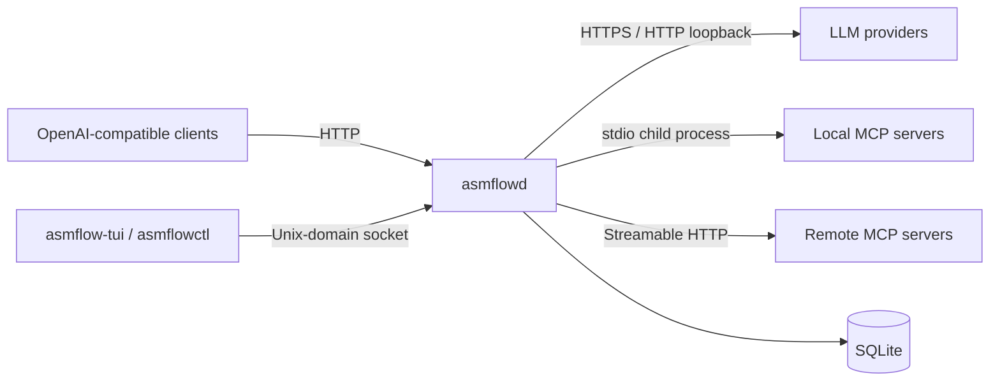

# AsmFlow Architecture

This document is the concise architectural contract. The detailed rationale and
performance targets are in `docs/TECHNICAL_WHITEPAPER_KR.md`; phase gates are in
`HARNESS.md`.

## 1. System context

AsmFlow is a local-first control plane between OpenAI-compatible clients, upstream LLM
endpoints, and configured MCP servers.



## 2. Process model

### `asmflowd`

A single long-running daemon owns mutable state, database writes, listeners, upstream
connections, health state, and MCP child processes. Its default concurrency model is a
single event loop based on Linux readiness notifications and libcurl multi. This avoids
shared-memory synchronization in the first implementation and makes ownership explicit.

### `asmflow-tui`

A separate ncursesw client displays and changes state through a local Unix-domain socket.
It never opens the SQLite database directly and cannot inherit provider secrets from the
daemon unless a specific redacted value is returned.

### Test and tooling processes

Python mock servers and reference oracles are test-only. They are not runtime
dependencies and may not become a hidden implementation of product behavior.

## 3. Ports and trust boundaries

- Data plane: `127.0.0.1:8080` by default; configurable.
- Control plane: `${XDG_RUNTIME_DIR}/asmflow/control.sock`, mode `0600`.
- Persistence: `${XDG_STATE_HOME}/asmflow/asmflow.db`, parent directory mode `0700`.
- Configuration: `${XDG_CONFIG_HOME}/asmflow/asmflow.json`, mode `0600` when it refers
  to secrets or private endpoints.

Non-loopback data-plane binding requires explicit configuration and authentication.
There is no TCP control plane in 1.0.

## 4. Module boundaries

```text
platform -> memory -> core -> json -> config -> storage
                               |             |
                               v             v
http/listener -> providers -> routing -> gateway
                     |            |
                     v            v
                   mcp         observability
                     \            /
                      control/TUI
```

Rules:

- `platform/` contains syscalls, signals, epoll, process, time, and filesystem adapters.
- `http/` owns sockets, connection state, limits, authentication, and response writing; llhttp is used only through `ffi/` for incremental HTTP/1.1 syntax parsing.
- `memory/` contains allocator wrappers, arenas, buffers, and ownership helpers.
- `core/` contains result/error types, IDs, queues, timers, and immutable value objects.
- `json/` contains bounded parsing, parser wrappers, and normalized accessors, not policy.
- `config/` owns the configuration model, the schema-equivalent validator, secret
  references, and allowlisted path expansion (ADR 0008). It calls `json/`; `json/`
  knows nothing about configuration.
- `providers/` knows upstream wire differences but cannot choose a provider.
- `routing/` chooses candidates from normalized metadata but performs no network I/O.
- `mcp/` owns protocol-era adapters and supervised process/HTTP state.
- `storage/` is the only runtime module that issues SQL.
- `control/` owns local operator commands and redacted snapshots.
- `tui/` is a separate binary and does not link provider or storage internals.
- `ffi/` is a narrow C ABI boundary. It may not contain application policy.

## 5. Request lifecycle

1. Accept and size-limit the HTTP request.
2. Assign or validate a request ID.
3. Parse the minimum routing envelope: endpoint, model alias, streaming mode, and selected
   capability fields.
4. Resolve the route and filter candidates by capability, health, concurrency, and
   operator state.
5. Select one candidate deterministically according to policy.
6. Build upstream URL and headers from configuration and secret references.
7. Dispatch through libcurl multi.
8. Buffer headers until routing can be committed.
9. On a pre-commit eligible failure, select the next candidate if policy permits.
10. Once any response byte is forwarded, mark `stream_started=true`; fallback and replay
    are permanently disabled for that request.
11. Propagate backpressure and cancellation.
12. Persist redacted metadata asynchronously within the same event loop.

## 6. Routing contract

Candidate ordering is total and deterministic. Ties are broken by configured target
order and stable provider ID, never by hash-map iteration order.

Supported 1.0 policies:

- `priority`: lowest numeric priority, then configured order.
- `round_robin`: stable rotation over eligible candidates within one route.
- `least_latency`: lowest exponentially weighted moving-average latency; unknown latency
  is ranked after healthy measured candidates and before unhealthy candidates.

Health states: `healthy`, `degraded`, `open`, `half_open`, `disabled`.

A circuit opens after the configured consecutive-failure threshold, remains open for a
cooldown, permits a bounded half-open probe, and closes only after a successful probe.

## 7. Streaming invariant

The router has two phases:

- `uncommitted`: no client-visible upstream bytes have been sent; eligible fallback may
  occur according to policy.
- `committed`: at least one byte or SSE event has been forwarded; the selected upstream is
  final. Failures terminate the client stream and are recorded, never replayed elsewhere.

This invariant prevents duplicated model work, double billing, and mixed-provider output.

## 8. MCP architecture

MCP support is dual-era and version-isolated:

- `modern_2026`: per-request `_meta`, optional `server/discover`, POST-only Streamable
  HTTP, request-scoped SSE, no protocol-level sessions.
- `legacy_2025`: initialization handshake and the corresponding stdio/HTTP lifecycle.
- `deprecated_2024_http_sse`: not implemented in the initial release unless an explicit
  compatibility milestone is approved.

The supervisor detects server era through the protocol-defined probe, caches it per
stdio process or HTTP origin, and routes all subsequent messages through that adapter.
Modern and legacy fields may not share a state structure except for normalized display
metadata.

AsmFlow 1.0 discovers capabilities and allows operator-initiated test calls. It does not
automatically feed MCP tools into an LLM request or execute model-generated tool calls.

## 9. Persistence

SQLite is opened by `asmflowd` as the single writer. WAL mode is used after successful
startup validation. Migrations are monotonic and transactional. Secrets and raw payloads
are not stored in database tables.

Core tables:

- `schema_migrations`
- `providers`
- `routes`
- `route_targets`
- `provider_health`
- `requests`
- `request_attempts`
- `mcp_servers`
- `mcp_capability_cache`
- `settings`

## 10. Memory and ABI

Every function documents ownership of pointer parameters and returns. External calls
follow the System V AMD64 ABI and preserve callee-saved registers. The stack is aligned
to 16 bytes before each C call. Variable-length inbound data enters bounded dynamic
buffers with checked addition and explicit maximums.

Long-lived objects use owner modules; request-scoped objects use an arena released at
request completion. No pointer from an arena may be stored in global state or SQLite
callback context.

## 11. Failure isolation

- Provider failure changes only provider health and the current request attempt.
- MCP child failure changes only that server instance and its capability cache.
- TUI crash does not affect daemon state.
- Database write failure degrades observability/config mutation but does not corrupt an
  already committed client stream.
- Unknown protocol fields are preserved or ignored according to the endpoint contract;
  they do not silently alter routing policy.

## 12. Architecture change control

The following require an ADR and maintainer approval:

- adding threads or shared writable memory;
- moving business logic into C;
- adding a new network listener or authentication mode;
- changing config schema migration rules;
- weakening no-fallback-after-commit;
- combining modern and legacy MCP adapters;
- allowing TUI direct database access;
- expanding 1.0 into automatic tool execution or agent orchestration.
